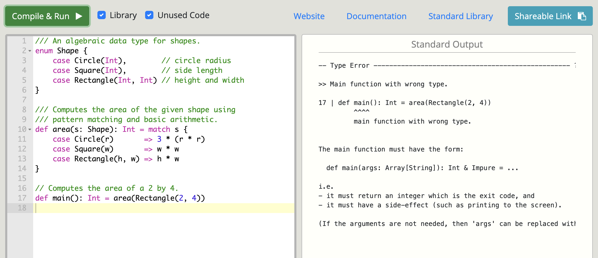
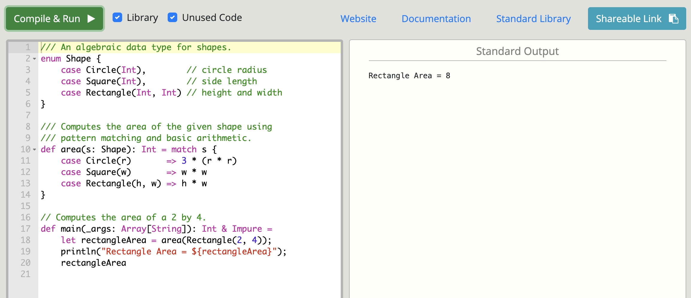
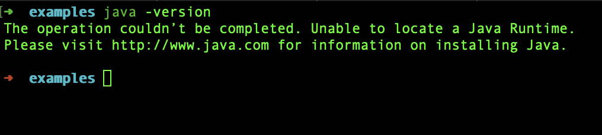
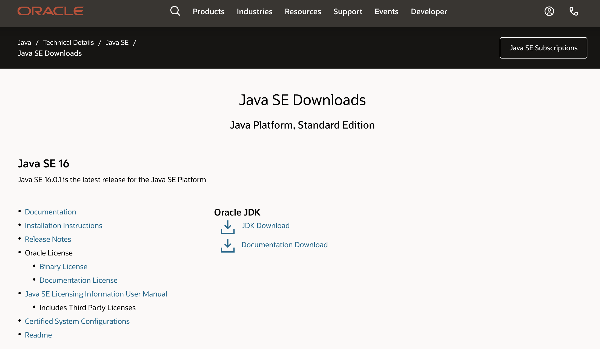
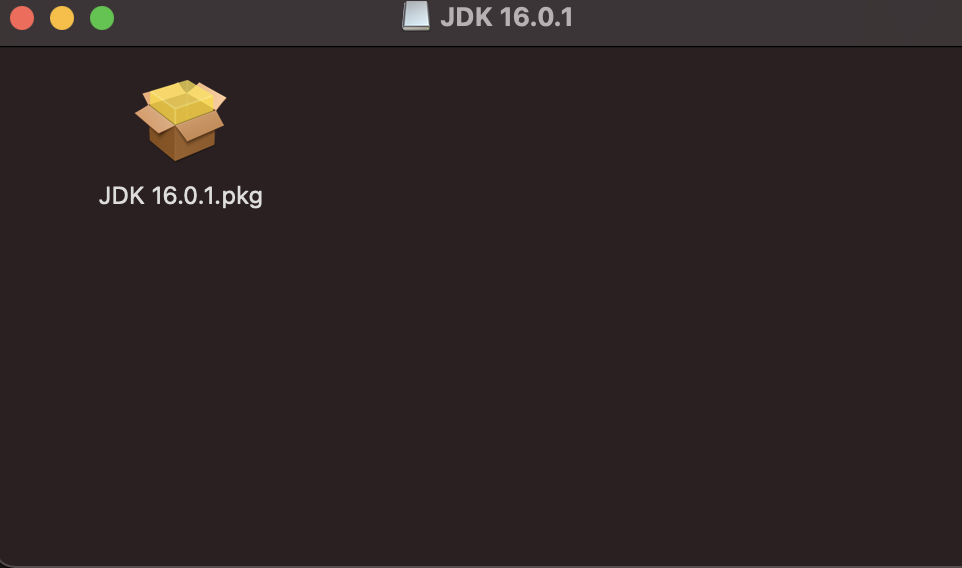
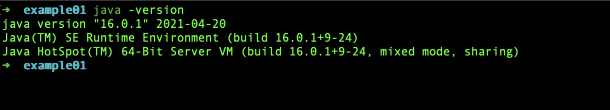
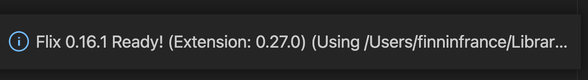
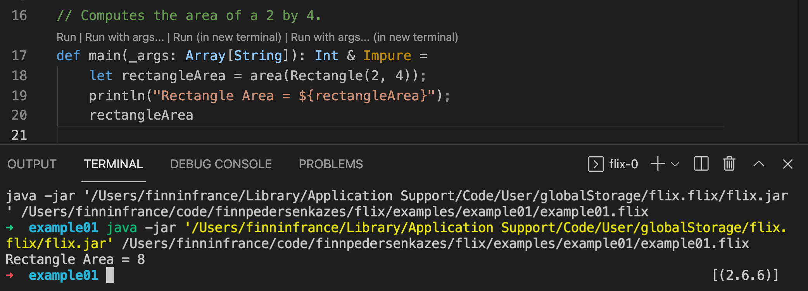
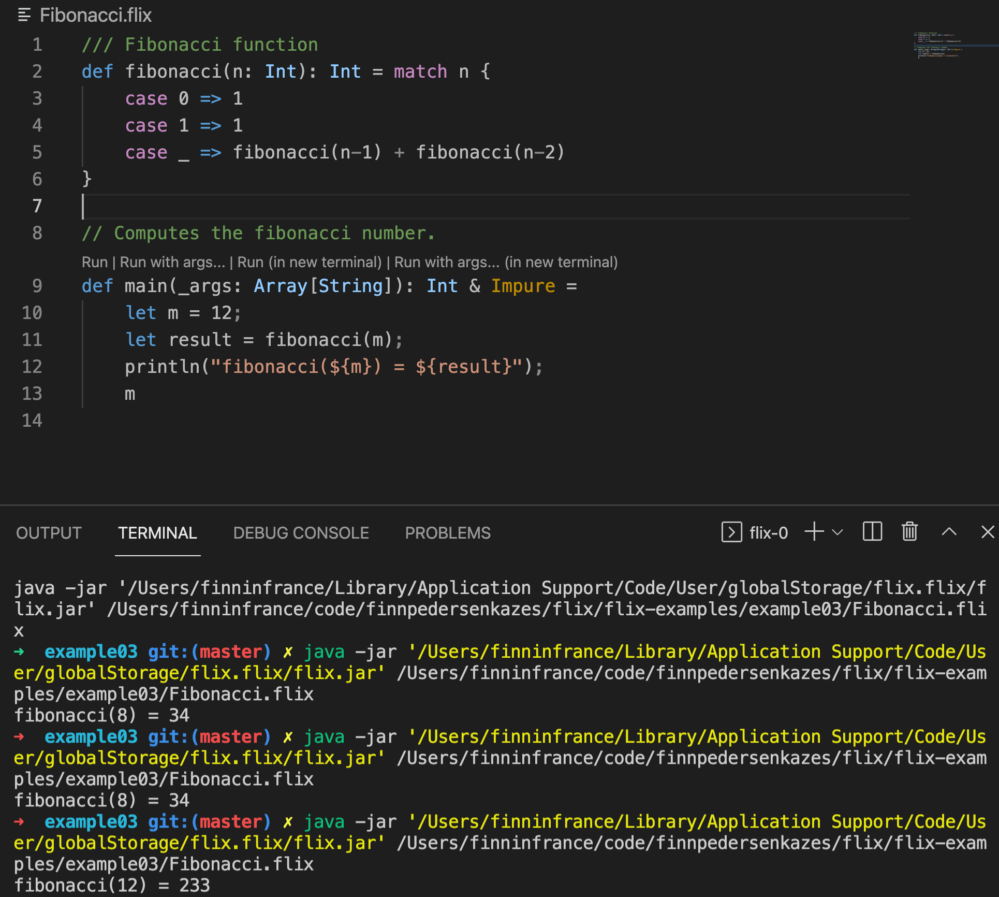
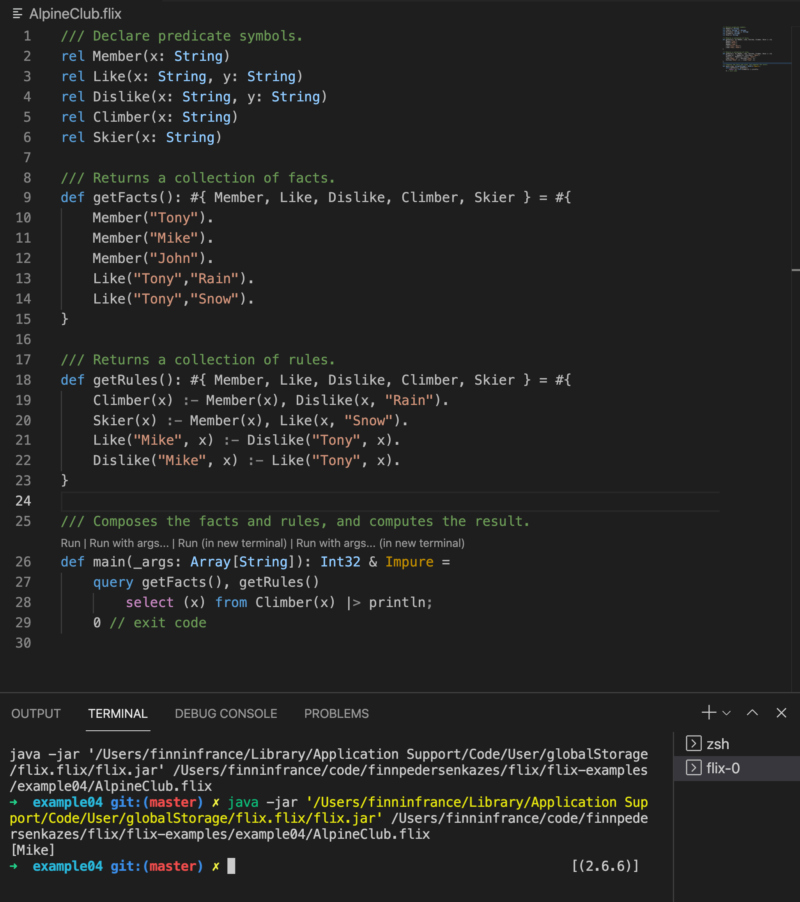

# Flix - A New Programming Language

## Introduction
I am reading Computerworld.dk just about every morning, but this morning is different. 
There is an [article](https://www.computerworld.dk/art/257120/datalogi-adjunkt-magnus-madsen-har-opfundet-et-nyt-programmeringssprog-vi-staar-over-for-et-skifte-inden-for-programmeringssprog-her-er-ideen-med-det-nye-flix) about a new programming language. [Magnus Madsen](https://github.com/magnus-madsen) has invented a new programming language.

Is it an imperative, logical or functional language? It is a hybrid. Both logical and functional. Now I'm curious. I read the code example. It looks a bit like prolog. 

I wrote programs in Prolog during my studies at DTU, so I know that some problems 
are better solved that way. 

### Concerning Programming Languages
I have been seduced by other modern languages and frameworks: 
- *Ruby on Rails.* Optimizing for **programmer happiness** with Convention over Configuration. [rubyonrails.org](https://rubyonrails.org/) 
- *Elm*. A **delightful** language for **reliable** web applications. [elm-lang.org](https://elm-lang.org/) 

So this is my reference when I decided to take a closer look at [flix.dev](https://flix.dev/)

## Getting Started
After a quick look at the front page, I decide to click Playground.
There is an example. I click Compile & Run. 



There is a Type Error. This is frustrating and gives a bad first impression.
But the error message tells me what is wrong, so I fix it.  



## Installation of Java
Before using Flix in Visual Studio Code, you need to have installed Java 16.

*In my first attempt, I installed the wrong version (1.8) of Java. It was both confusing and frustrating.*

### Check that Java is installed

Open the Terminal and type: `java -version`



If Java is not installed or you have the wrong version, you will see, at the very buttom, it says: 

```
Requires Java 11 (or later).
- Ensure that the java command is on your path.
```

### Install Java SE 16

https://www.oracle.com/java/technologies/javase-downloads.html




The link to the downloads.

https://www.oracle.com/java/technologies/javase-jdk16-downloads.html


I download and run the `jdk-16.0.1_osx-x64_bin.dmg` file. 





I go back to the Terminal window and run the `java -version` again. 



### Visual Studio Code
Open Visual Studio Code and install the [Visual Studio Code extension for Flix](https://marketplace.visualstudio.com/items?itemName=flix.flix). 

## Success!


The trick is to open Visual Studio Code from the terminal with the folder name as argument. 

````
code example02
````

Then you click Run. The link just above `def main`.



## Time to Play
To be sure not to run into problems too quickly, modify and extend the existing example.  

````
/// An algebraic data type for shapes.
enum Shape {
    case Circle(Int),        // circle radius
    case Square(Int),        // side length
    case Rectangle(Int, Int) // height and width
    case Triangle(Int, Int)  // height and width
}

/// Computes the area of the given shape using 
/// pattern matching and basic arithmetic.
def area(s: Shape): Int = match s {
    case Circle(r)       => 3 * (r * r)
    case Square(w)       => area(Rectangle(w, w))
    case Rectangle(h, w) => h * w
    case Triangle(h, w)  => area(Rectangle(h, w)) / 2
}

// Computes the area of a 2 by 4 triangle.
def main(_args: Array[String]): Int & Impure = 
    let triangleArea = area(Triangle(2, 4));
    println("Triangle Area = ${triangleArea}");
    triangleArea
````

So far so good. A few things could be improved.  

- The type of the functions should have been decimal or floating point rather than integer.
- The value of pi is rounded to 3.  

So that would be a good exercise to change that. 
I also like the code to be easy to read with a high level of abstraction, so I introduce 
type aliases for `Float` and `Int`, and a function that returns the value of *pi*. I don't know yet, why the main function has to return an integer, but I roll with it and introduces a function that returns an integer. 

````
/// Type alias for Float and Int
type alias Decimal = Float
type alias Integer = Int

/// An algebraic data type for shapes.
enum Shape {
    case Circle(Decimal),          // circle radius
    case Square(Decimal),          // side length
    case Rectangle(Decimal, Decimal) // height and width
    case Triangle(Decimal, Decimal)  // height and width
}

def pi(): Decimal = 
    3.141592653589793238

def one(): Integer = 
    1

/// Computes the area of the given shape using 
/// pattern matching and basic arithmetic.
def area(s: Shape): Decimal = match s {
    case Circle(r)       => pi() * (r * r)
    case Square(w)       => area(Rectangle(w, w))
    case Rectangle(h, w) => h * w
    case Triangle(h, w)  => area(Rectangle(h, w)) / 2.0
}

// Computes the area of a circle with radius 4.
def main(_args: Array[String]): Integer & Impure = 
    let circleArea = area(Circle(4.0));
    println("Circle Area = ${circleArea}");
    one()
````
The output is

 `Circle Area = 50.26548245743669`. 

## Fibonacci
The Fibonacci function is always a good test of a programming language. 
How elegantly can you express this function?



Flix does a good job. 

This is how fibonacci looks in Elm. 

````
fibonacci : Int -> Int
fibonacci n = 
  case n of 
    0 -> 1 
    1 -> 1 
    _ -> fibonacci (n-2) + fibonacci (n-1)
````

I think that Elm has the most elegant implementation of the fibonacci function compared to all the languages I know. It does not get any simpler or more elegant that this. 

# Datalog

Functional programming is nice and powerful, but the real reason for me to be excited about Flix, is [Datalog](https://en.wikipedia.org/wiki/Datalog). 

30 years ago, I wrote an [Interpreter for Datalog](https://github.com/finnpedersenkazes/master-thesis) as part of my Master's Thesis at [DTU](https://www.dtu.dk/english). During the past 30 years, I only once met someone who also worked with Datalog.

Let us take a look at an example from my Master's Thesis. 

## The Alpine Club 

In the Alpine Club all members are skiers or (mountain) climbers. 
All climbers do not like rain. All skiers like snow. 
Tony, Mike, and John are members of the Alpine Club. 
Mike likes what Tony dislikes and Mike dislikes what Tony likes. 
Tony likes both rain and snow. 

Who among the members are climbers?




I am impressed. Flix finds the expected result that Mike is the only climber in the club. 

[Source Code on GitHub](https://github.com/finnpedersenkazes/flix-examples/tree/master/example04)

# Sugestions for Improvements

## What problems are best solved with Flix?
The reason for a new programming language should be to solve at least one problem better
than anyone else. 

[PDC](https://www.pdc.com/) used [Prolog](https://www.visual-prolog.com/) to develop planning systems. That is, they build a Prolog compiler and then they build the best planning applications with that. 

So the question is what family of applications can Flix solve better than anyone else?

**Suggestion**: 

Provide examples where Flix is more elegant than any other language. 

## First Impression
Compare the [Flix front page](https://flix.dev/) with the [Elm front page](https://elm-lang.org/). Look at how welcoming and approchable Elm is. So much nicer. 

**Suggestion**: 

Create a much simpler front page and ensure that the new users get a successful experience right from the start. Move the less important information to a separate page about the history and inspiration for the language. 

## Playground

**Suggestion**: 
- Get the example in the Playground to work.
- Make all the examples available in the Playground, so that you can play with them.
- Have more Datalog examples.

## Compiler
**Suggestion**: 
- Make the error messages even more helpful. A la Elm.

## Installation of Java
Java is not installed by default on either Windows 10 or MacOS, and there is confusion about what exactly to install. So installing and making sure that it works, before installing the Visual Code Extension, is key to a good first impression. I was tricked into installing Java 8 (1.8) at first. 

**Suggestion**: 

Write a section on how to install Java, with links to the official download pages and how to check that the right version is installed. 

## Data Types
### Short or Informative
This is actually not specific to Flix. 
Why do we abbreviate the data types? This is not helpful.

**Suggestion**: 

We write `String`, so we should write `Integer` and `Boolean`. 
Abbreviating them does not help the new developer and we don't need to save characters. Elm has the same problem with unnecessary abbreviations like `Msg`, `Cmd`, `Int`, `Bool` ...  

Maybe we do this to seduce developers from similar languages, but quite frankly it is just a bad habit. 

Flix let me use type aliases, if I want a more informative type, but then I loose the colors of the editor. 

````
/// Type alias for Float and Int
type alias Decimal = Float
type alias Integer = Int
````

### Size of Integers
Flix proposes `Int8`, `Int16`, `Int32`, `Int64`, and `BigInt`. Is this because of the Java implementation? Do we, as developers, really need to know this level of detail? 

**Suggestion**: 

I would advocate for a higher level of abstraction and I have seen how letting the developer decide on the length is a source of error. 
Further you need conversion functions. This an unnecessary loss of focus. 

Keep it simple: `Integer` and `BigInteger` should be enough and similar for other datatypes like real numbers that we could name `Decimal` numbers.

## Get rid of the abbreviations
All these abbreviations makes programming a closed club anchered in the past. Let's move on and make the code intuitive and easy to read for the new programmer and everyone else. 

**Suggestion**: 

Why don't we write `define` or `function` instead of `def`. 
And so on. 

## GitHub
**Suggestion**: 

Get GitHub to recognize Flix as a language. I presume this will come in time. 


# What I really like in a programming language
At the end of this review of Flix, allow me to reflect on some of the 
properties I appreciate in programming languages. 

- The code should be easy to read and understand.
- A high level of abstraction. 
- Compiler error messages should help the developer. 
- Automatic formating of the code. No manual indentation.
- Powerfull expressions (less code is better) 
- Optimized for compare of differences. We spend 99% of our time changing code. Elm does a good job here. 

*Note: Elm has more lines of code, because of its slim design and it is good for compare.* 

## Ruby
Ruby has many delightful ways of writing expressions as you think about it. 

Consider
````
x = y / z unless z == 0
````

Though `unless` has to be used with caution and its use is discussed, I really like 
to express functionality the way I think about it. 

## Elm
Elm is known for its helpful compiler messages. [Compiler Errors for humans](https://elm-lang.org/news/compiler-errors-for-humans)

### Maybe
I just love the `Maybe` in Elm. It makes so much sense and makes the code elegant and robust. 

### Automatic indentation
Elm is optimal for an easy compare of changes. 
Look at the comma being in front of the element. 
This is simply a brilliant and bold move from the designers.

Code just snap in place. 


````
main : Program () Model Msg
main =
    Browser.element
        { view = view
        , init = \() -> init
        , subscriptions = subscriptions
        , update = update
        }
````
